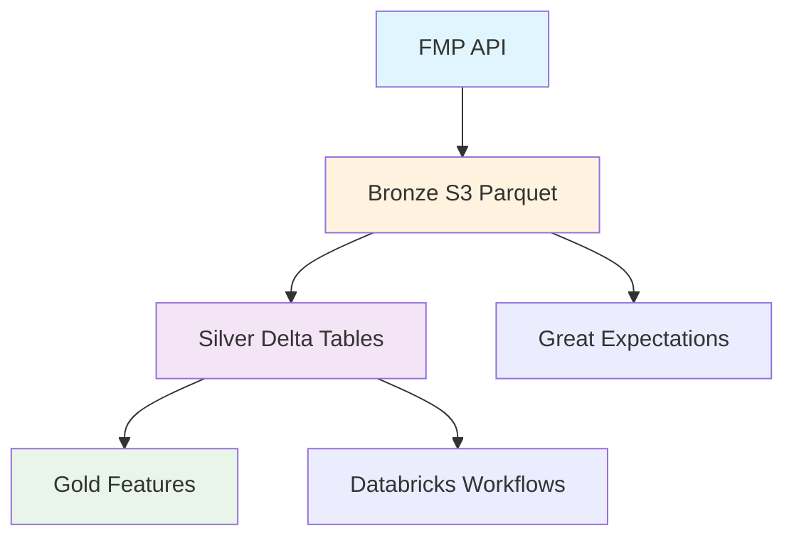

# E2E Stock Data Pipeline

Production-ready data pipeline that ingests financial data from FMP API, processes it through 
Bronze→Silver→Gold medallion architecture, and delivers analytics-ready datasets. Combines 
daily OHLCV price data with annual fundamental metrics for comprehensive equity analysis.

[](https://github.com/MateoClagg/E2E-Stock-Data-Pipeline/actions/workflows/ci.yml)
[](https://codecov.io/gh/MateoClagg/E2E-Stock-Data-Pipeline)

## Architecture



## Directory structure

```
bronze/
├── ingestion/
│   ├── fmp_bronze.py
│   └── schemas.py
└── utils.py
silver/
├── transformations/
│   ├── clean_data.py
│   └── validity_windows.py
└── views/
    └── unified_views.py
tests/
├── test_silver_transformations.py
├── test_silver_views.py
└── test_fmp_ingest.py
.github/workflows/
└── ci.yml
```

## Installing the Package

> **⚠️ IMPORTANT: Package Name Mapping**  
> **Install:** `stock-pipeline` (with hyphen)  
> **Import:** `stock_pipeline` (with underscore) + `bronze`, `silver`, `ingestion`, `validation`

### From CodeArtifact (Production)
```python
# In Databricks notebook or cluster init script
%pip install stock-pipeline==X.Y.Z --index-url https://<domain>-<account_id>.d.codeartifact.<region>.amazonaws.com/pypi/<repository>/simple/

# Then import the modules
import stock_pipeline
import bronze, silver, ingestion, validation
```

### From Unity Catalog Volume (Alternative)
```python
# If wheels are copied to Unity Catalog Volumes
%pip install /Volumes/<catalog>/<schema>/<volume>/wheels/stock-pipeline/X.Y.Z/stock_pipeline-X.Y.Z-py3-none-any.whl
```

### For Development (Editable Install)
```python
# In Databricks Repos or local development
%pip install -e "."
```

### Local Development Setup
```bash
git clone https://github.com/MateoClagg/E2E-Stock-Data-Pipeline.git
cd E2E-Stock-Data-Pipeline
python -m venv .venv && .venv\Scripts\Activate
pip install -r requirements.txt 
pytest -q -m "not integration"                     # unit tests
pytest -m integration --runlive                    # live FMP tests (needs FMP_API_KEY)
```

## 📦 Package Installation & Usage

> **⚠️ IMPORTANT**: Install `stock-pipeline` (hyphen) but import `stock_pipeline` + modules (underscore)

### Quick Test Locally
```bash
pip install -e .  # Development install
python -c "import bronze, silver, stock_pipeline; print('✅ Works!')"
```

### Production Installation (when ready)
See [`docs/operations/RELEASING.md`](docs/operations/RELEASING.md) for AWS CodeArtifact setup.

## 🚀 CI/CD Pipeline

- **PR Builds**: Fast 5-minute builds with downloadable wheels
- **Main Builds**: Comprehensive testing + PySpark compatibility  
- **Releases**: Automatic publishing on git tags (`v1.2.3`)

See [`docs/ci-cd/`](docs/ci-cd/) for full CI/CD documentation.

## 📚 Documentation

- **[🚀 QUICK_START.md](QUICK_START.md)** - Get started immediately
- **[📁 docs/ci-cd/](docs/ci-cd/)** - CI/CD workflows and optimization
- **[🔒 docs/security/](docs/security/)** - Security policies and practices  
- **[⚙️ docs/operations/](docs/operations/)** - Production operations guides
- **[📊 databricks/](databricks/)** - Databricks integration guides

## Roadmap / next sprints

- Databricks Silver processing notebooks
- Daily orchestration with GitHub Actions schedules
- Gold layer fair-value and momentum features
- Streamlit analytics dashboard
- Terraform infrastructure as code

## Tech stack & key libraries

PySpark 3.5, Delta Lake 3.0, Databricks Workflows, AWS S3, Great Expectations, 
GitHub Actions.

## Contributing & license

PRs welcome. MIT license.