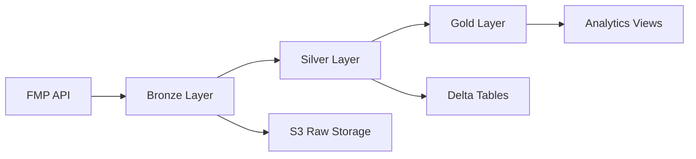

# 📊 E2E Stock Fair-Value Pipeline

[](../../actions/workflows/pr-build.yml)
[](https://www.python.org/downloads/)
[](LICENSE)
[](https://github.com/astral-sh/ruff)

> **Cost-optimized financial data lakehouse** for stock market analysis using local ingestion + Databricks transformations.

## 🏗️ **Architecture Overview**

**Cost-First Design**: API wait time runs locally, Databricks only for data transforms

```
Local/EC2        S3 Raw           Databricks Serverless         Analytics
┌─────────┐     ┌─────────┐      ┌─────────────────────────┐    ┌─────────┐
│  FMP    │     │ Parquet │─────▶│ Auto Loader → Bronze    │    │ MLflow  │
│  APIs   │────▶│ by      │      │ (CDF) → Silver (MERGE)  │───▶│ Feature │
│ (local) │     │ symbol/ │      │ → Gold (features)       │    │ Store   │
└─────────┘     └─────────┘      └─────────────────────────┘    └─────────┘
                                          │
                                          ▼
                                  Databricks SQL/Athena
```

## 🎯 **Key Benefits**

- **💰 Cost Optimized**: 70% cost reduction by offloading API wait time from Databricks
- **🚀 Scalable**: Designed for 1,000+ tickers, 5+ years of history
- **⚡ Fast Development**: Local testing without expensive compute
- **🔄 Flexible**: Keep existing Databricks expertise for transformations
- **📊 Production Ready**: Enterprise security, monitoring, and CI/CD

## ✨ **Features**

- **📈 Multi-source Data**: Price data, income statements, cash flow, and balance sheets
- **⚡ Async Processing**: Concurrent API calls with built-in rate limiting  
- **🗂️ Smart Partitioning**: Optimized for query performance and cost
- **🔍 Data Quality**: Great Expectations validation with quarantine patterns
- **🏦 Lakehouse Format**: Parquet (raw) → Delta (analytics) for ACID + time travel

## 🚀 **Quick Start**

### Local Ingestion (Cost-Optimized)
```bash
# 1. Setup environment
pip install -e .
export FMP_API_KEY="your_api_key"
export S3_BUCKET_BRONZE="s3://your-bucket"

# 2. Run local ingestion (no Databricks needed)
python -m bronze.ingestion.fmp --tickers AAPL,MSFT --backfill

# 3. Data flows to S3 → Ready for Databricks transforms
```

### Databricks Lakehouse (Next Phase)
```sql
-- Auto-load from S3 → Delta tables
COPY INTO bronze_prices FROM 's3://your-bucket/raw/prices/'

-- Transform to analytics-ready format  
MERGE INTO silver_prices USING bronze_prices ...
```

**Cost Target**: <$30/month total (S3: $10 + Databricks: <$20)

## 🏗️ **Architecture**

### **Medallion Data Flow**


### **Package Structure**
```
📦 stock-pipeline/
├── 🥉 bronze/              # Raw data ingestion
│   ├── ingestion/          # FMP API client and schemas  
│   └── utils.py           # Spark configuration and S3 utilities
├── 🥈 silver/              # Data transformations
│   ├── transformations/    # Cleaning and business logic
│   └── views/             # Unified analytical views
├── 🔍 validation/          # Data quality (Great Expectations)
├── 🧪 tests/              # Comprehensive test suite
├── 📊 docs/               # Documentation by topic
└── ⚙️ .github/workflows/   # CI/CD automation
```

## 📊 **Data Pipeline**

| Layer | Purpose | Technology | Output Format |
|-------|---------|------------|---------------|
| **Bronze** | Raw ingestion | AsyncIO + FMP API | S3 Parquet (partitioned) |
| **Silver** | Cleaning & transformations | PySpark + Delta | Delta Tables |
| **Gold** | Analytics & aggregation | SQL + Views | Databricks Views |

## 🔧 **Development**

### **Local Development**
```bash
git clone <repository-url>
cd E2E-Stock-Data-Pipeline
pip install -e .
pytest tests/ -v
```

### **CI/CD Pipeline**
- **PR Builds**: Fast validation (≤5 min) - linting, imports, basic tests
- **Main Builds**: Comprehensive testing (≤10 min) - full test suite, PySpark validation  
- **Release Builds**: Production deployment - CodeArtifact publishing, security auditing

### **Databricks Integration**
```python
# Auto-install from Unity Catalog Volume
%pip install /Volumes/catalog/schema/volume/wheels/stock-pipeline/latest/

# Or from private CodeArtifact
%pip install stock-pipeline --index-url <codeartifact-url>
```

## 📋 **Requirements**

- **Python 3.10+**
- **Apache Spark 3.5+** (for local development)  
- **Databricks Runtime 13.0+** (for production)
- **AWS S3** access for data storage
- **FMP API subscription** for market data

## 🧪 **Testing Strategy**

```bash
# Unit tests (fast, no external dependencies)
pytest tests/ -m "not integration"

# Integration tests (requires API keys and S3)  
pytest tests/ -m integration

# PySpark tests (validates Databricks compatibility)
pytest tests/test_silver_* -v
```

## 📚 **Documentation**

| Document | Description |
|----------|-------------|
| **[🚀 Getting Started](GETTING_STARTED.md)** | Installation and quick setup |
| **[📋 Setup Requirements](SETUP_REQUIREMENTS.md)** | Complete production setup |
| **[📊 Databricks Setup](databricks/DATABRICKS_SETUP.md)** | Unity Catalog configuration |
| **[📚 Full Documentation](docs/README.md)** | Complete documentation index |

## 🤝 **Contributing**

We welcome contributions! Please see our [Contributing Guidelines](CONTRIBUTING.md) for details.

1. **Fork** the repository
2. **Create** a feature branch (`git checkout -b feature/amazing-feature`)
3. **Test** your changes (`pytest tests/ -v`)
4. **Commit** with clear messages
5. **Submit** a Pull Request

## 📊 **Performance**

- **API Rate Limiting**: 5 requests/second (configurable)
- **Concurrent Processing**: Multiple tickers processed in parallel
- **S3 Partitioning**: Optimized for time-series queries
- **Delta Lake**: ACID transactions and time travel
- **Memory Optimized**: Configurable Spark memory settings

## 🔒 **Security & Compliance**

- **OIDC Authentication**: No long-lived AWS credentials
- **Supply Chain Security**: SBOM generation and vulnerability scanning
- **Secrets Management**: Environment variable based configuration
- **Access Control**: IAM roles and policies for least-privilege access

## 📄 **License**

This project is licensed under the MIT License - see the [LICENSE](LICENSE) file for details.

---

**Built with ❤️ for the financial data community**# Trigger main build
