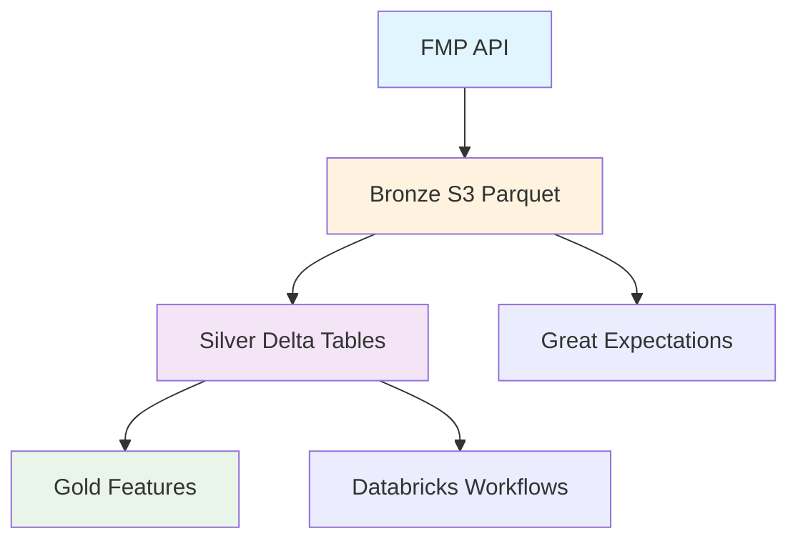

# E2E Stock Data Pipeline

Production-ready data pipeline that ingests financial data from FMP API, processes it through 
Bronze→Silver→Gold medallion architecture, and delivers analytics-ready datasets. Combines 
daily OHLCV price data with annual fundamental metrics for comprehensive equity analysis.

[](https://github.com/MateoClagg/E2E-Stock-Data-Pipeline/actions/workflows/ci.yml)
[](https://codecov.io/gh/MateoClagg/E2E-Stock-Data-Pipeline)

## Architecture



## Directory structure

```
bronze/
├── ingestion/
│   ├── fmp_bronze.py
│   └── schemas.py
└── utils.py
silver/
├── transformations/
│   ├── clean_data.py
│   └── validity_windows.py
└── views/
    └── unified_views.py
tests/
├── test_silver_transformations.py
├── test_silver_views.py
└── test_fmp_ingest.py
.github/workflows/
└── ci.yml
```

## Quick-start (local)

```bash
git clone https://github.com/MateoClagg/E2E-Stock-Data-Pipeline.git
cd E2E-Stock-Data-Pipeline
python -m venv .venv && .venv\Scripts\Activate
pip install -r requirements.txt 
pytest -q -m "not integration"                     # unit tests
pytest -m integration --runlive                    # live FMP tests (needs FMP_API_KEY)
```

## CI pipeline

- **Lint**: flake8 syntax and style checks
- **Unit tests**: Bronze/Silver transformation logic (no external dependencies)
- **Coverage**: pytest-cov with Codecov reporting
- **Integration tests**: Live FMP API and Spark operations (main branch only)

## Roadmap / next sprints

- Databricks Silver processing notebooks
- Daily orchestration with GitHub Actions schedules
- Gold layer fair-value and momentum features
- Streamlit analytics dashboard
- Terraform infrastructure as code

## Tech stack & key libraries

PySpark 3.5, Delta Lake 3.0, Databricks Workflows, AWS S3, Great Expectations, 
GitHub Actions.

## Contributing & license

PRs welcome. MIT license.