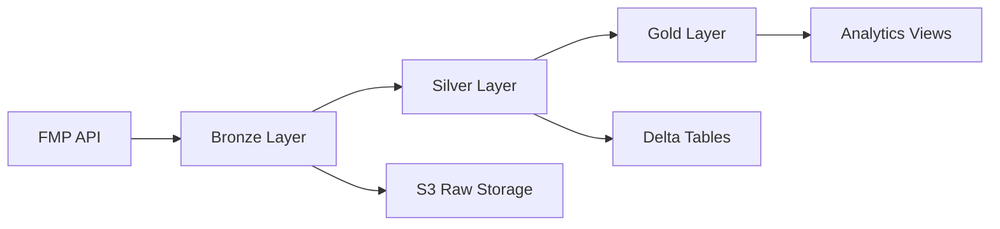

# 📊 Stock Market Data Pipeline

[](../../actions/workflows/pr-build.yml)
[](https://www.python.org/downloads/)
[](LICENSE)

> **Cost-optimized stock data ingestion** - Local async FMP API fetching → S3 Parquet → Databricks medallion architecture.

## 🏗️ **Architecture Overview**

**Cost-First Design**: API wait time runs locally (GitHub Actions/EC2), Databricks only for data transformations.

```
Local/GitHub Actions  S3 Raw Zone          Databricks Serverless         Analytics
┌─────────────────┐   ┌──────────────┐    ┌─────────────────────────┐    ┌─────────┐
│ FMP API         │   │ Day-level    │───▶│ Auto Loader → Bronze    │    │ Delta   │
│ (async fetch)   │──▶│ Parquet      │    │ (CDF) → Silver (MERGE)  │───▶│ Tables  │
│ polars/pyarrow  │   │ partitions   │    │ → Gold (features)       │    │ & Views │
└─────────────────┘   └──────────────┘    └─────────────────────────┘    └─────────┘
                                                      │
                                                      ▼
                                              Databricks SQL/Athena
```

## 🎯 **Key Benefits**

- **💰 Cost Optimized**: 70% cost reduction by offloading API wait time from Databricks
- **🚀 Scalable**: Designed for 1,000+ tickers, 5+ years of history
- **⚡ Fast Development**: Local testing without expensive compute
- **🔄 Flexible**: Keep existing Databricks expertise for transformations
- **📊 Production Ready**: Enterprise security, monitoring, and CI/CD

## ✨ **Features**

- **📈 Multi-source Data**: Price data, income statements, cash flow, and balance sheets
- **⚡ Async Processing**: Concurrent API calls with built-in rate limiting  
- **🗂️ Smart Partitioning**: Optimized for query performance and cost
- **🔍 Data Quality**: Great Expectations validation with quarantine patterns
- **🏦 Lakehouse Format**: Parquet (raw) → Delta (analytics) for ACID + time travel

## 🚀 **Quick Start**

```bash
# 1. Install dependencies
pip install -e .

# 2. Configure environment (.env file)
export FMP_API_KEY="your_api_key"
export S3_BUCKET="your-bucket"
export AWS_ACCESS_KEY_ID="..."
export AWS_SECRET_ACCESS_KEY="..."

# 3. Run local ingestion (yesterday's data)
python stock_pipeline/scripts/ingest_local_to_s3.py

# 4. Backfill historical data
python stock_pipeline/scripts/ingest_local_to_s3.py --backfill-days 30
```

**Output:** Day-partitioned Parquet in `s3://{bucket}/raw/prices/symbol=X/year=Y/month=M/day=D/`

**Monthly Cost**: ~$50 total (FMP API: $30, S3: <$10, Databricks: <$10)

## 🏗️ **Architecture**

### **Medallion Data Flow**


### **Package Structure**
```
📦 stock-pipeline/
├── 📊 stock_pipeline/
│   ├── scripts/
│   │   ├── ingest_local_to_s3.py   # Main ingestion script (async + polars)
│   │   └── utils/
│   │       └── dates.py            # Trading calendar utilities
│   └── config/
│       └── tickers.csv             # Default ticker list
├── 🧪 tests/
│   └── test_ingest_local.py        # Unit tests
├── 📊 docs/
│   └── ingestion_quickstart.md     # Complete ingestion guide
└── ⚙️ .github/workflows/
    └── ingest.yml                   # Nightly cron + manual dispatch
```

**Note:** Bronze/Silver/Gold transformations live in Databricks (not in this repo).

## 📊 **Data Pipeline**

| Layer | Purpose | Technology | Location |
|-------|---------|------------|----------|
| **Raw Zone** | Local async ingestion | aiohttp + polars + boto3 | S3 Parquet (day-partitioned) |
| **Bronze** | Auto Loader streaming | Databricks Auto Loader | Delta Tables (CDF enabled) |
| **Silver** | Cleaning & transformations | PySpark + Delta MERGE | Delta Tables |
| **Gold** | Analytics & features | SQL + Views | Databricks Views/Tables |

## 🔧 **Development**

```bash
# Clone and install
git clone <repository-url>
cd E2E-Stock-Data-Pipeline
pip install -e .

# Run tests
pytest tests/test_ingest_local.py -v

# Test locally with your FMP key
python stock_pipeline/scripts/ingest_local_to_s3.py --tickers-path stock_pipeline/config/tickers.csv
```

### **CI/CD Pipeline**
- **PR Builds**: Fast validation - linting, imports, unit tests
- **Main Builds**: Full test suite + S3 wheel uploads
- **Ingestion Workflow**: Nightly cron (Mon-Fri 11 PM UTC) + manual dispatch

## 📋 **Requirements**

- **Python 3.10+**
- **AWS S3** access
- **FMP API subscription** ($30/month for real-time data)
- **Databricks workspace** (optional, for Bronze/Silver/Gold transformations)

## 🧪 **Testing**

```bash
# Unit tests
pytest tests/test_ingest_local.py -v

# Test specific components
pytest tests/test_ingest_local.py::TestS3KeyBuilder -v
pytest tests/test_ingest_local.py::TestPolarsTransformations -v
```

## 📚 **Documentation**

| Document | Description |
|----------|-------------|
| **[🚀 Getting Started](GETTING_STARTED.md)** | Installation and quick setup |
| **[📊 Ingestion Guide](docs/ingestion_quickstart.md)** | Complete local ingestion documentation |
| **[🔧 Databricks Setup](databricks/DATABRICKS_SETUP.md)** | Unity Catalog + Auto Loader configuration |

## 🤝 **Contributing**

We welcome contributions! Please see our [Contributing Guidelines](CONTRIBUTING.md) for details.

1. **Fork** the repository
2. **Create** a feature branch (`git checkout -b feature/amazing-feature`)
3. **Test** your changes (`pytest tests/ -v`)
4. **Commit** with clear messages
5. **Submit** a Pull Request

## 📊 **Performance**

- **API Rate Limiting**: 5 requests/second (configurable)
- **Concurrent Processing**: Multiple tickers processed in parallel
- **S3 Partitioning**: Optimized for time-series queries
- **Delta Lake**: ACID transactions and time travel
- **Memory Optimized**: Configurable Spark memory settings

## 🔒 **Security & Compliance**

- **OIDC Authentication**: No long-lived AWS credentials
- **Supply Chain Security**: SBOM generation and vulnerability scanning
- **Secrets Management**: Environment variable based configuration
- **Access Control**: IAM roles and policies for least-privilege access

## 📄 **License**

This project is licensed under the MIT License - see the [LICENSE](LICENSE) file for details.

---

**Built with ❤️ for the financial data community**# Trigger main build
